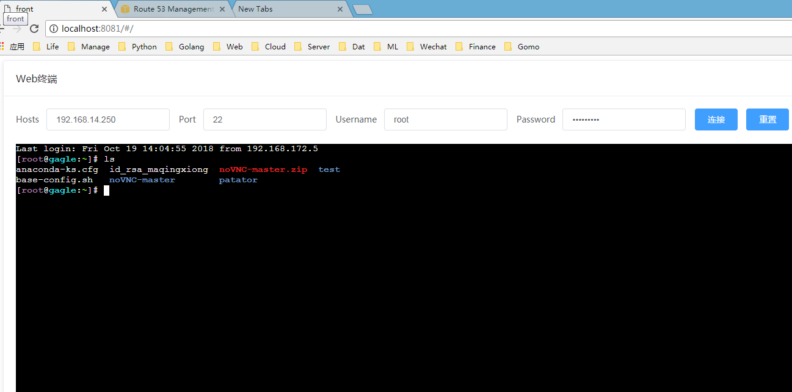

## webterminal
在django项目中web终端的实现

## 启动django服务
- 安装依赖包：`pip install -r requirement.txt`
- websocket服务器配置：指定settings.py里websocket所需要的redis服务器信息
- 启动服务:进入项目根目录，执行 start_server.bat 或 start_server.sh

## 启动vue前端服务
- cd webterminal
- npm install && npm run dev
- 访问：http://localhost:8081/#/

## 效果图
